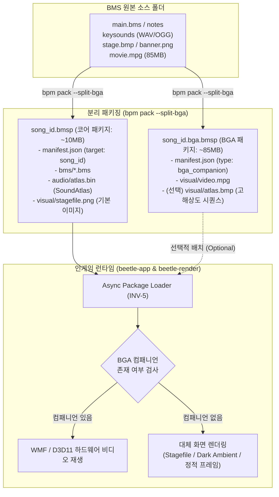

# BGA 컴패니언 패키지 및 동영상 분리 아키텍처 제안서 (Decoupled BGA Companion Package System)

본 문서는 `bms-package`, `bms-package-manager`, `beetle-app` 및 `bpm-gui`를 확장하여, **BMS 패키지 용량의 50%~90%를 차지하는 대용량 BGA 동영상(`.mpg`, `.wmv`, `.mp4`) 및 고해상도 비주얼 에셋을 기본 곡 패키지에서 선택적 컴패니언 패키지(`.bga.bmsp`)로 분리**하는 아키텍처 설계 사양서입니다.

---

## 1. 배경 및 문제 정의 (Background & Problem Definition)

### 1.1 현황 분석
실제 BMS 라이브러리 패키징 테스트 결과, 음원 번들 아틀라스(`OggBundle`, `WavBundle`)를 통해 키음 용량을 30%~60% 이상 절감했음에도 불구하고, 여전히 50MB~100MB를 상회하는 대용량 패키지들이 다수 존재합니다:

| 곡명 | 전체 패키지 용량 | 키음 음원 크기 | **BGA 동영상 크기** | 동영상 용량 점유율 |
| :--- | :---: | :---: | :---: | :---: |
| `junk_g2r2018_ogg` | 101.52 MB | 9.01 MB | **92.46 MB** (`.wmv`) | **91.1%** |
| `Yamajet_SpellBound` | 91.62 MB | 9.85 MB | **81.01 MB** (`.mpg` 2개) | **88.4%** |
| `[TJhangneil]ozma` | 55.41 MB | 23.43 MB | **31.14 MB** (`.mpg`) | **56.2%** |
| `[siromaru]conflict` | 52.68 MB | 15.14 MB | **31.65 MB** (`.mpg`) | **60.1%** |
| `[sakuzyo]Vallista` | 46.42 MB | 19.15 MB | **27.20 MB** (`.mpg`) | **58.6%** |

### 1.2 핵심 문제점
1. **압축 불가 고엔트로피 스트림**: 동영상 파일은 이미 H.264/WMV9/MPEG-1 코덱으로 비손실/손실 압축되어 있어 ZIP/Deflate 알고리즘으로 압축 시 용량 절감 효과가 0~1% 미만에 불과합니다.
2. **네트워크 대역폭 및 스토리지 낭비**: 원격 레지스트리 다운로드 및 모바일/스팀덱 등 저용량 스토리지 환경에서 90MB에 달하는 동영상 다운로드는 진입 장벽으로 작용합니다.
3. **리듬게임 플레이어 성향 불일치**: 많은 코어 리듬게임 플레이어는 채보 가독성 향상과 집중을 위해 인게임 설정에서 BGA를 끄거나(Off), 어둡게(Dim 50~80%) 설정하고 플레이하므로, 모든 사용자에게 고화질 동영상 다운로드를 강제하는 것은 비효율적입니다.

---

## 2. 목표 및 핵심 설계 원칙 (Design Principles)

1. **초경량 코어 패키지 (Ultra-light Base Package)**:
   - 동영상이 분리된 기본 곡 패키지(`<id>.bmsp`)는 **5MB ~ 25MB** 내외로 축소됩니다.
   - 기본 패키지만으로 즉시 게임 플레이가 가능해야 합니다 (동영상 부재 시 부드러운 대체 렌더링).
2. **무중단 점진적 BGA 결합 (Zero-Friction Companion Pairing)**:
   - 동영상 에셋은 `<id>.bga.bmsp`라는 독립 보조 패키지로 분리 배포됩니다.
   - 같은 폴더에 존재하기만 하면 게임 클라이언트(`beetle-app`)와 VFS가 자동으로 감지 및 마운트하여 BGA를 재생합니다.
3. **완전한 하위 호환성 (Full Backward Compatibility)**:
   - 기존의 단일 일체형 패키지(동영상이 포함된 기존 `.bmsp`)도 변경 없이 100% 그대로 지원합니다.
4. **결정론 및 아키텍처 불변식 준수**:
   - 패키지 분리 시에도 [INV-1](오디오 마스터 클럭), [INV-5](논블로킹 백그라운드 I/O), [INV-6](결정론적 아카이브) 규칙을 철저히 준수합니다.

---

## 3. 시스템 아키텍처 (System Architecture)

### 3.1 패키지 분리 및 로딩 다이어그램



---

## 4. 세부 기술 규격 (Technical Specifications)

### 4.1 매니페스트(`manifest.json`) 확장

`crates/bms-package/src/manifest.rs`의 `Manifest` 구조체에 패키지 유형과 연관 컴패니언 메타데이터를 추가합니다.

```json
{
  "format_version": 2,
  "id": "junk_g2r2018_ogg",
  "name": "Junk G2R 2018",
  "artist": "Junk",
  "type": "standard",
  "companion_packages": {
    "bga": {
      "required": false,
      "recommended_filename": "junk_g2r2018_ogg.bga.bmsp",
      "size_bytes": 96952832,
      "sha256": "e3b0c44298fc1c149afbf4c8996fb92427ae41e4649b934ca495991b7852b855"
    }
  },
  "sound_atlas": {
    "codec": "ogg_bundle",
    "file": "audio/atlas.bin",
    "sample_rate": 44100,
    "channels": 2,
    "total_frames": 11838491,
    "slices": { ... }
  },
  "charts": [ "junk_another.bme", "junk_hyper.bme" ]
}
```

BGA 컴패니언 패키지(`junk_g2r2018_ogg.bga.bmsp`) 내부의 `manifest.json`:

```json
{
  "format_version": 2,
  "id": "junk_g2r2018_ogg_bga",
  "name": "Junk G2R 2018 (BGA Pack)",
  "type": "bga_companion",
  "target_package_id": "junk_g2r2018_ogg",
  "files": [
    {
      "path": "visual/bga.wmv",
      "size": 96952832,
      "sha256": "..."
    }
  ]
}
```

### 4.2 패키징 CLI 플래그 사양 (`crates/bms-package-manager/src/pack.rs`)

`bpm pack` 명령에 BGA 제어 플래그를 추가합니다:

```bash
# 1. 기본 모드 (기존 동일: 일체형 단일 .bmsp 생성)
bpm pack ./D_BMS_Song -o song.bmsp --profile turbo

# 2. BGA 동영상 분리 모드 (코어 팩과 BGA 팩 2개 동시 출력)
bpm pack ./D_BMS_Song -o song.bmsp --profile turbo --split-bga
# 출력:
#   song.bmsp      (12.4 MB - 악곡 채보 + 키음 사운드 아틀라스)
#   song.bga.bmsp  (88.2 MB - 고화질 동영상 비주얼 에셋)

# 3. 동영상 완전 제외 모드 (최소 용량 코어 팩만 출력)
bpm pack ./D_BMS_Song -o song.bmsp --profile turbo --no-video
# 출력:
#   song.bmsp      (12.4 MB - 동영상 완전 제외)
```

---

## 5. 인게임 런타임 탐색 및 대체 렌더링 (`beetle-app`)

### 5.1 컴패니언 BGA 탐색 계층 (Search Hierarchy)
채보에서 `#BMP00` 또는 영상 참조 태그가 등장했을 때, 비디오 로더는 다음 우선순위로 영상을 탐색합니다:

1. **메인 패키지 내부**: `song.bmsp` 내부에 `visual/video.*`가 존재하는 경우 (일체형 레거시 패키지).
2. **컴패니언 패키지**: 동일 디렉토리 내 `song.bga.bmsp` 또는 `<song_id>.bga.bmsp`가 존재하는 경우 VFS 또는 아카이브에서 비디오 스트림 획득.
3. **외부 VFS 캐시**: `packages/<id>/bga/` 등 로컬 매니저 관리 캐시 경로.
4. **부재 시 폴백(Graceful Fallback)**:
   - 정적 BGA 텍스처 아틀라스에 해당 키가 있으면 해당 2D 스프라이트 출력.
   - 정적 프레임도 없으면 곡의 `stagefile` 또는 은은한 배경 앰비언트 비주얼로 자동 대체.
   - **판정 엔진 및 오디오 클럭([INV-1])은 비디오 부재와 무관하게 0.00ms 오차로 완벽 구동**.

### 5.2 논블로킹 비디오 스트리밍 ([INV-5] 준수)
- BGA 비패키지/패키지 로딩은 메인 UI 루프를 블로킹하지 않도록 Worker 스레드에서 비동기 핸들을 반환합니다.
- 동영상 로딩 실패나 지연이 발생하더라도 게임 루프 프레임드랍(렉)이 발생하지 않습니다.

---

## 6. 패키지 관리자 및 GUI 연동 사양 (`bpm`, `bpm-gui`)

### 6.1 `bpm` CLI 관리 명령
```bash
# 곡 설치 (기본: 코어 패키지만 경량 설치)
bpm install junk_g2r2018_ogg

# 곡 설치 시 BGA 패키지도 함께 설치
bpm install junk_g2r2018_ogg --with-bga

# 이미 설치된 곡에 BGA 패키지만 추가 설치
bpm bga install junk_g2r2018_ogg

# 용량 확보를 위해 특정 곡(또는 전체)의 BGA 컴패니언만 제거 (악곡 플레이는 유지)
bpm bga remove junk_g2r2018_ogg
```

### 6.2 `bpm-gui` UI 디자인
1. **BGA 상태 뱃지 (Status Badge)**:
   - `[BGA: Embedded]` : 일체형 패키지 (녹색)
   - `[BGA: Companion]` : 분리 패키지 설치됨 (청색)
   - `[BGA: None]` : 동영상 없음 / 코어만 설치됨 (회색)
2. **원클릭 용량 다이어트 버튼**:
   - `"BGA 컴패니언 일괄 삭제 (코어 음원 유지)"`: 디스크 용량이 부족할 때 클릭 한 번으로 게임 플레이를 보존한 채 수 기가바이트(GB)의 동영상 용량을 즉시 확보.
3. **패킹 다이얼로그 옵션 체크박스**:
   - `[x] BGA 동영상 별도 패키지로 분리 (--split-bga)`

---

## 7. 단계별 구현 계획 (Phased Implementation Plan)

- [ ] **Phase 1 (패키지 포맷 및 빌더 지원)**:
  - `crates/bms-package/src/manifest.rs`에 `PackageType::BgaCompanion` 및 컴패니언 메타데이터 정의.
  - `crates/bms-package-manager/src/pack.rs`에 `--split-bga` 및 `--no-video` 옵션 구현.
- [ ] **Phase 2 (VFS 및 런타임 탐색기 구현)**:
  - `crates/bms-package-manager/src/vfs.rs`에서 `<id>.bga.bmsp` 페어링 마운트 지원.
  - `crates/beetle-app/src/loader.rs`에서 컴패니언 비디오 탐색 및 안전한 폴백 렌더러 연동.
- [ ] **Phase 3 (CLI 및 GUI 기능 탑재)**:
  - `bpm` CLI에 `bga install / remove` 서브커맨드 추가.
  - `bpm-gui` 패킹 패널에 BGA 분리 체크박스 및 목록 뱃지 적용.
