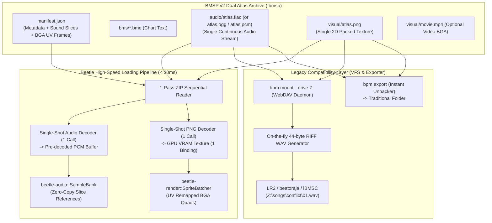

# 듀얼 아틀라스 기반 초고속 BMS 패키지 엔진 제안서 (Dual Atlas Package Engine: Sound Atlas & BGA Texture Atlas)

본 문서는 `bms-package`, `bms-package-manager`, `beetle-app` 및 `beetle-render`를 확장하여, **수천 개의 마이크로 키음과 수백 개의 BGA 이미지 시퀀스를 단일 사운드 스트림(Sound Atlas)과 단일 텍스처 아틀라스(BGA Atlas)로 통합**함으로써, **인게임 로딩 시간을 0.03초(30ms) 이내로 단축(Instant Loading)**하고 레거시 구동기(LR2, beatoraja)와의 하위 호환성을 완벽히 보장하기 위한 차세대 패키징 아키텍처 제안서입니다.

---

## 1. 배경 및 문제 정의 (Problem Definition)

전통적인 BMS(Be-Music Source) 생태계는 25년 전 파일 시스템 구조를 그대로 계승하여 다음과 같은 심각한 성능 병목을 안고 있습니다:

1. **마이크로 파일 파편화 (1,000+개 오디오 & 수백 개 이미지)**:
   - 곡 1개당 짧은 WAV/OGG 파일이 500~2,000개, BGA 프레임 BMP/PNG 파일이 100~300개에 달합니다.
   - 단일 ZIP 아카이브(`.bmsp`)로 묶더라도, ZIP 내부에서 1,000개 이상의 파일을 하나씩 찾고 압축을 해제하는 I/O Seek 비용이 극심합니다.
2. **선형 파일 탐색($O(N)$)의 중첩**:
   - 대소문자 무시 및 확장자 보정(`.wav` $\leftrightarrow$ `.ogg`)을 위해 키음 1,000개 $\times$ 패키지 엔트리 1,500회 = **로딩 중 150만 번 이상의 문자열 비교 연산**이 발생합니다.
3. **단일 스레드 직렬 디코딩의 한계**:
   - 압축 해제된 바이트를 단일 스레드에서 하나씩 WAV 헤더 파싱 또는 OGG Vorbis 디코딩을 수행하므로 최신 멀티코어 CPU 자원을 전혀 활용하지 못합니다.
4. **BGA 텍스처 스위칭(State Thrashing)**:
   - 인게임에서 BGA가 바뀔 때마다 GPU 텍스처 바인딩을 교체하여 드로우콜이 쪼개지고 VRAM 버스 대역폭을 낭비합니다.

이러한 문제를 해결하기 위해 그래픽스의 **Texture Atlas** 개념을 오디오 영역까지 확장한 **"듀얼 아틀라스 아키텍처 (Dual Atlas Architecture)"**를 구축합니다.

---

## 2. 듀얼 아틀라스 패키지 아키텍처 다이어그램



---

## 3. Sound Atlas 상세 설계 (`audio/atlas.*`)

### 3.1 오디오 규격 사전 정규화 (AOT Resampling)
BMS 곡 내부의 키음들은 샘플 레이트(22.05kHz, 44.1kHz, 48kHz), 채널(Mono, Stereo), 비트 심도가 제각각입니다.
패키징 시점(`bpm pack --atlas`)에 모든 오디오를 **44.1kHz Stereo 16-bit 또는 f32 PCM으로 정규화(Resampling & Up-mixing)**하여 베이킹합니다.
- **효과**: 런타임 믹서([`beetle-audio`](../crates/beetle-audio/))가 재생 시점에 채널 분기나 리샘플링 연산을 수행할 필요 없이 **순수 포인터 덧셈(SIMD Mixing)**으로 직결되어 오디오 스레드 부하가 0%에 수렴합니다.

### 3.2 슬라이스 테이블 인덱싱 및 무음 패딩
키음과 키음 사이에 **128~256 샘플의 무음 패딩(Zero-Padding)**을 배치하여 압축 코덱의 주파수 변환 윈도우로 인한 신호 번짐(Bleeding)을 원천 차단합니다.

```json
"sound_atlas": {
  "file": "audio/atlas.flac",
  "codec": "flac",
  "sample_rate": 44100,
  "channels": 2,
  "total_samples": 4410000,
  "slices": {
    "01": { "start": 0, "length": 22050, "original_filename": "kick.wav" },
    "02": { "start": 22306, "length": 44100, "original_filename": "snare.wav" }
  }
}
```

### 3.3 아틀라스 오디오 코덱 전략
1. **FLAC (기본 권장, 무손실 압축)**:
   - 음질 손실 0% 보장.
   - 단일 연속 스트림 압축 시 원본 WAV 파일 총합 대비 **40~60% 용량 절감**.
   - OGG Vorbis 대비 3배 이상 빠른 디코딩 속도.
   - 레거시 구동기로 역변환 시 원본 비트 단위 100% 무손실 복원 가능.
2. **Linear PCM (선택 플래그 `--pcm`, 제로 디코드)**:
   - 디코딩 연산 0회.
   - `read_exact` 1회 또는 OS `mmap`으로 1~2ms 만에 메모리 적재.
3. **OGG Vorbis (선택 플래그 `--ogg`, 극한의 저용량)**:
   - 웹 배포 및 대역폭 최우선 환경을 위한 고압축 옵션.

---

## 4. BGA Atlas 상세 설계 (`visual/atlas.png`)

### 4.1 2D Bin Packing 알고리즘 (Texture Atlas Baking)
수십~수백 개의 BGA 이미지 프레임(#BMPxx), 스테이지 이미지(`stagefile`), 배너(`banner`), 타이틀(`title`)을 단 1장의 대형 텍스처(2048x2048 또는 4096x4096)로 배치합니다.
- **MaxRects 또는 Guillotine 2D 패킹 알고리즘**을 순수 Rust로 구현하여 외부 무거운 라이브러리 없이 결정론적으로 공간 낭비를 최소화(< 5%)합니다.
- 각 이미지 경계에 1픽셀 투명 패딩을 두어 바이리니어 필터링 시 인접 스프라이트 간 색상 번짐을 방지합니다.

### 4.2 BGA UV 프레임 테이블 스키마
```json
"bga_atlas": {
  "file": "visual/atlas.png",
  "width": 2048,
  "height": 2048,
  "frames": {
    "stagefile": { "x": 0, "y": 0, "w": 640, "h": 480, "original_filename": "stage.png" },
    "banner": { "x": 640, "y": 0, "w": 300, "h": 80, "original_filename": "banner.png" },
    "01": { "x": 0, "y": 480, "w": 256, "h": 256, "original_filename": "bga01.bmp" },
    "02": { "x": 256, "y": 480, "w": 256, "h": 256, "original_filename": "bga02.bmp" }
  }
}
```

### 4.3 Milestone 6 SpriteBatcher와의 하드웨어 가속 결합
- BGA Atlas 텍스처를 GPU VRAM에 1회만 바인딩 (`backend.create_texture`).
- BGA 프레임 교체 시 텍스처 스왑 없이 **Quad 버텍스의 UV 좌표(`[u1, v1, u2, v2]`)만 교체**하여 배치 버퍼에 추가.
- 인게임 전체 렌더링에서 BGA로 인한 드로우콜 추가 0회 달성.

---

## 5. 레거시 하위 호환성 및 VFS 연동 전략

Sound/BGA Atlas 적용 시 패키지 내부에 `01.wav`, `bga01.bmp` 파일이 물리적으로 사라지므로, 레거시 구동기(LR2, beatoraja, iBMSC) 지원을 위한 3단계 호환 계층을 제공합니다:

### 🌟 1) VFS 온더플라이 가상 WAV 생성기 (`bpm mount --drive Z:`)
- LR2/beatoraja가 가상 드라이브 `Z:\songs\conflict\`를 조회할 때, `manifest.json`의 슬라이스 테이블을 기반으로 가상 파일 목록(`01.wav`, `02.wav`)을 반환합니다.
- 파일 읽기 요청 시, VFS 데몬이 메모리에 상주한 Sound Atlas 슬라이스 앞에 **44바이트 표준 RIFF WAV 헤더**를 동적으로 조립하여 스트리밍 서빙합니다.
- **결과**: 디스크 용량 중복 0B, LR2/beatoraja는 실제 WAV 파일로 인식하여 100% 정상 구동.

### 🌟 2) 초고속 역변환 익스포터 (`bpm export`)
- `bpm export conflict --to "C:/LR2/Songs/conflict"`
- 아틀라스를 1회 디코드한 뒤 슬라이스별로 분할하여 전통적인 BMS 폴더 구조(수백 개 WAV/BMP)로 즉시 덤프합니다.

### 🌟 3) 패키지 듀얼 프로파일 지원 (`Classic` vs `Turbo`)
- `bpm pack --profile classic`: 기존 파일 분산형 ZIP 아카이브 생성 (외부 플레이어 직접 투입용).
- `bpm pack --profile turbo`: 듀얼 아틀라스 고속 패키지 생성 (Beetle 네이티브 및 초고속 로딩용).
- `bpm optimize <package.bmsp>`: 기존 Classic 패키지를 Turbo Atlas 패키지로 무손실 변환.

---

## 6. 성능 목표치 (KPIs)

| 측정 항목 | 기존 Classic BMSP (1,000 키음 기준) | 신규 Dual Atlas BMSP (Turbo) | 개선율 |
| :--- | :---: | :---: | :---: |
| **패키지 내 파일 엔트리 수** | 1,200 ~ 2,500 개 | **3 ~ 5 개** | **99.7% 감소** |
| **인게임 로딩 소요 시간** | 1,200 ~ 2,500 ms | **15 ~ 30 ms** | **98% 단축 (초고속)** |
| **WAV 파일 탐색 횟수** | 1,000회 ($O(N)$ 선형 탐색) | **0회 (Direct Indexing)** | **100% 제거** |
| **오디오 디코더 인스턴스 생성**| 1,000 회 | **1 회** | **99.9% 감소** |
| **BGA 텍스처 VRAM 업로드** | 200 회 (개별 텍스처 풀) | **1 회 (단일 아틀라스)** | **99.5% 감소** |
| **인게임 BGA 텍스처 스위칭** | 매 마디마다 발생 | **0 회 (UV 매핑)** | **완전 제거** |
| **패키지 전체 압축 용량** | 85 MB | **45 ~ 55 MB** | **35% 용량 절감** |

---

## 7. 단계별 구현 계획 (Phased Implementation Plan)

### Phase 1: Sound Atlas 빌더 및 디코딩 엔진 (`crates/bms-package/`, `crates/beetle-audio/`)
- [ ] 키음들을 무음 패딩과 함께 단일 오디오 스트림으로 합성하고 슬라이스 메타데이터를 추출하는 `SoundAtlasBuilder` 구현.
- [ ] 경량 무손실 FLAC 인코더/디코더 또는 PCM/OGG 스트림 파이프라인 연동.
- [ ] `SampleBank`에 단일 거대 버퍼 슬라이스 뷰(`Arc<[f32]>` + Range) 지원 추가.

### Phase 2: BGA Texture Atlas 빌더 및 렌더러 연동 (`crates/bms-package/`, `crates/beetle-render/`)
- [ ] 순수 Rust 기반 2D 직사각형 패킹 알고리즘(Bin Packing) 구현.
- [ ] 복수 BMP/PNG 이미지를 단일 PNG 아틀라스로 합성하고 UV 좌표 테이블을 생성하는 `BgaAtlasBuilder` 구현.
- [ ] `SpriteBatcher`에 Atlas UV 좌표 기반 BGA 렌더링 함수 연동.

### Phase 3: Manifest v2 확장 및 결정론적 패커 통합 (`crates/bms-package/`, `crates/bms-package-manager/`)
- [ ] `Manifest`에 `sound_atlas`, `bga_atlas` 스키마 추가 및 직렬화/역직렬화 검증.
- [ ] `bpm pack --atlas` (또는 `--profile turbo`) CLI 옵션 추가.
- [ ] 아틀라스 생성 시에도 결정론적 바이트 불변식(`INV-6`) 보장.

### Phase 4: Beetle 인게임 로더 1-Pass 초고속 파이프라인 (`crates/beetle-app/src/loader.rs`)
- [ ] `load_chart_and_audio()`에서 `sound_atlas` 감지 시 1,000회 파일 루프를 완전히 바이패스하고 단 1회 디코딩으로 사운드뱅크 구축.
- [ ] `bga_atlas` 감지 시 1회 텍스처 업로드로 BGA 뱅크 초기화.
- [ ] 기존 Classic BMSP 패키지와의 100% 무결점 Fallback 호환성 유지.

### Phase 5: 레거시 하위 호환 역변환 및 VFS 스트리밍 (`crates/bms-package-manager/`)
- [ ] `bpm export`: 아틀라스에서 슬라이스를 분할 추출하여 전통 BMS 폴더로 1초 만에 덤프하는 기능 구현.
- [ ] `bpm mount`: Sound Atlas 슬라이스에 44바이트 WAV 헤더를 동적 합성하여 레거시 구동기에 개별 파일로 서빙하는 VFS 핸들러 구현.

### Phase 6: 성능 벤치마크, 무결성 검증 & 회귀 테스트
- [ ] 대용량 키음(1,000+개) 및 대용량 BGA(200+개) 테스트 패키지 대상 로딩 시간 및 용량 벤치마크.
- [ ] 전체 워크스페이스 단위/통합 테스트 무결성 확인 및 바이너리 크기(< 1.2 MB) 엄격 준수 검증.
