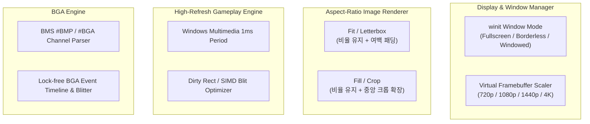

# 디스플레이 다원화, 종횡비 보존 렌더링, 초고주사율 최적화 및 BGA 지원 제안서

본 문서는 Beetle 리듬 게임 엔진의 디스플레이/창 제어 고도화, 이미지 왜곡 방지 및 종횡비 보존 렌더링, 인게임 초고주사율 극한 최적화, 그리고 BGA(BackGround Animation) 시스템 구현을 위한 아키텍처 제안서입니다.

---

## 1. 배경 및 목표 (Background & Goals)

Beetle은 독립 실행 및 초경량 바이너리를 유지하면서도 쾌적한 아케이드급 리듬 게임 경험을 제공해야 합니다.
이를 위해 플레이어의 다양한 디스플레이 환경과 시각적 몰입감을 극대화하기 위한 4대 핵심 개선 과제를 정의합니다.

1. **디스플레이 및 창 모드 다원화**:
   * `Fullscreen (독점 전체화면)`, `Borderless Fullscreen (전체화면 창모드)`, `Windowed (창모드)` 지원 및 자유로운 해상도 조절.
2. **종횡비 보존 이미지 렌더링 (Aspect-Ratio Aware Fitting)**:
   * 4:3, 16:9, 1:1 등 곡마다 제각각인 자켓/배너/스테이지 이미지가 영역에 맞추어 비정상적으로 늘어나거나 찌그러지는 왜곡 현상 방지.
   * `Fit / Letterbox` 및 `Fill / Crop` 모드 지원.
3. **인게임 초고주사율 프레임 페이싱 및 렌더러 극한 최적화**:
   * 144Hz, 240Hz, 360Hz+ 게이밍 모니터 환경에서 완벽하게 일정한 프레임 타임을 보장하는 고정밀 프레임 페이싱 및 소프트웨어 렌더러 최적화.
4. **BGA (BackGround Animation) 시스템 도입**:
   * BMS의 `#BMP`, `#BGA`, `#BGALAYER` 기반 타이밍 동기화 애니메이션 시퀀스 및 경량 비디오 BGA 재생 지원.

---

## 2. 세부 설계 및 아키텍처 (Detailed Design)

### 1) 창 크기 및 디스플레이 모드 시스템 (Display & Window Mode)
* **지원 모드**:
  * `Windowed`: 기본 1280x720 또는 사용자 지정 창 크기 (자유로운 리사이즈 및 DPI 스케일링 대응).
  * `Borderless Fullscreen`: 현재 바탕화면 해상도 및 화면 주사율을 그대로 유지하는 테두리 없는 전체화면.
  * `Exclusive Fullscreen`: 모니터의 최고 주사율과 독점 제어를 활용하는 전체화면.
* **가상 해상도 & 스케일러**:
  * 내부 렌더링 버퍼(`tiny-skia` Pixmap)는 1280x720 또는 고해상도 타겟으로 렌더링한 뒤, `softbuffer`에 정수 배율(Integer Scaling) 또는 선형 보간으로 최종 출력.
  * `config.json`에 `display_mode`, `window_width`, `window_height`, `target_fps`를 저장하여 앱 재시작 시 유지.

---

### 2) 반응형 이미지 종횡비 보존 렌더링 (Aspect-Ratio Aware Image Fitting)
* **문제점**: 다양한 BMS의 스테이지 이미지(BMP/PNG) 해상도(256x256, 640x480, 1920x1080 등)를 $320 \times 180$ 고정 프레임에 강제로 축소할 때 상하/좌우 왜곡 발생.
* **해결 방안**:
  1. **`Fill & Center Crop` (권장 기본값)**:
     * 원본 이미지의 종횡비를 엄격하게 보존하면서 타겟 영역을 꽉 채우도록 스케일링한 후, 넘치는 상하 또는 좌우 영역을 중앙 기준으로 깔끔하게 크롭.
  2. **`Fit & Letterbox`**:
     * 원본 전체가 다 보이도록 스케일링하고, 남는 영역은 다크 배경 패딩 또는 앰비언트 블러(Ambient Blur) 처리.
  3. **동적 UI 패널 확장**:
     * 선곡 창 및 인게임 HUD에서 이미지 영역 자체를 이미지 비율에 맞추어 유동적으로 확장 렌더링.

---

### 3) 인게임 초고주사율 프레임 페이싱 & 렌더러 극한 최적화
* **Windows 고정밀 타이머 Period 활성화**:
  * Windows 기본 타이머 해상도(15.6ms)로 인한 `sleep` 지터를 방지하기 위해 `timeBeginPeriod(1)`을 적용하여 서브밀리초 단위 정밀 프레임 유지.
* **소프트웨어 렌더러 핫패스 최적화**:
  * 픽셀 버퍼 채우기 및 사각형 드로우 시 32-bit `u32` 청크 쓰기 및 SIMD 연산 적용.
  * 이전 프레임 대비 변화가 없는 정적 HUD 영역의 Dirty Rect 캐싱 검토.

---

### 4) BGA (BackGround Animation) 시스템 지원
* **BMS 표준 BGA 스펙 지원**:
  * `#BMPxx`: 인덱스별 이미지 시퀀스 정의.
  * `#BGAxx`: 특정 좌표 슬라이스 및 투명색(ColorKey) 레이어 정의.
  * 채보 트랙의 BGA 이벤트 채널(04: BGA Base, 06: Poor, 07: BGA Layer)을 파싱하여 타임라인에 등록.
* **초경량 BGA 렌더링 아키텍처**:
  * 곡 로딩 시 BGA 이미지들을 메모리 텍스처 풀로 사전 적재.
  * `AudioClock` 시간에 맞추어 현재 활성 BGA 프레임을 $O(1)$로 교체하여 인게임 BGA 영역에 렌더링.
  * 외부 코덱 의존성을 배제하기 위해 이미지 시퀀스 기반 고성능 BGA를 우선 지원하고, 향후 무의존성 경량 비디오 디코딩 방안 검토.
