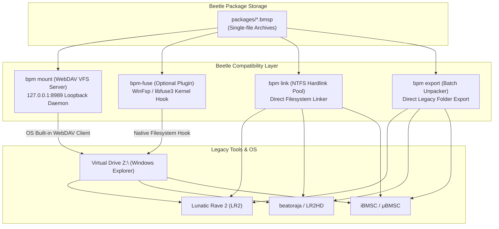

# 레거시 하위 호환 및 VFS 마운트 확장 제안서 (Legacy Compatibility & VFS Mount Proposal)

본 문서는 Beetle의 단일 패키지 포맷(`.bmsp`)을 유지하면서도, **기존 레거시 BMS 구동기(LR2, beatoraja, Qwilight, nanasi 등) 및 BMS 에디터(iBMSC, μBMSC)**와의 완벽한 하위 호환성을 제공하기 위한 가상 파일 시스템(VFS) 및 투명 마운트 계층 확장 제안서입니다.

---

## 1. 배경 및 문제 정의 (Problem Definition)

Beetle은 배포 편의성과 무결성 보장을 위해 곡당 단일 파일 아카이브(`.bmsp`)를 사용합니다. 
그러나 지난 25년간 형성된 방대한 BMS 생태계의 도구들은 다음과 같은 특성을 갖습니다:
1. **디스크 디렉터리 경로 기반 탐색**: LR2, beatoraja 등은 실제 파일 시스템 경로(`C:\LR2\Songs\TrackName\*.wav`)를 스캔하여 실행합니다.
2. **단일 아카이브 미지원**: 기존 도구들은 `.bmsp` 컨테이너 내부를 직접 읽을 수 없습니다.
3. **디스크 중복 문제**: 하위 호환을 위해 모든 `.bmsp`의 압축을 디스크에 풀면 수십~수백 GB의 디스크 용량이 2배로 낭비됩니다.

이를 해결하기 위해 **"디스크 용량 중복 0%, 추가 드라이버 설치 0개"**를 만족하는 **VFS(가상 파일 시스템) 마운트 계층**을 도입합니다.

---

## 2. 하위 호환 VFS 아키텍처 다이어그램



---

## 3. 4대 하위 호환 전략 상세 설계

### 🌟 전략 1 (핵심 권장): 외부 드라이버 없는 "내장 WebDAV VFS 드라이브"
- **작동 원리**:
  - `bpm mount --drive Z:` 명령 실행 시 `bpm`이 백그라운드에서 초경량 HTTP/WebDAV 서버(`127.0.0.1:8989`)를 구동.
  - Windows의 기본 내장 네트워크 드라이브 마운트 API(`WNetAddConnection2` 또는 `net use Z: http://127.0.0.1:8989 /persistent:no`)를 실행하여 **`Z:\` 가상 드라이브**로 즉시 연결.
- **장점**:
  - **드라이버 무설치 (Zero-Dependency)**: Windows, Linux, macOS에 기본 탑재된 OS 네트워크 클라이언트를 활용하므로 외부 커널 드라이버 설치가 일체 불필요합니다.
  - **디스크 용량 0% 중복**: LR2가 `Z:\songs\conflict\main.bms`를 읽을 때 `bpm` 데몬이 `.bmsp` 아카이브에서 실시간 스트리밍으로 메모리 압축 해제하여 응답합니다.
  - **Read-Only 안전성**: 레거시 툴이 실수로 원본 BMS 데이터를 훼손하는 것을 방지합니다.

### 🌟 전략 2: FUSE / WinFsp 네이티브 커널 VFS (`crates/bpm-fuse`)
- **작동 원리**:
  - Linux에서는 `libfuse3`, Windows에서는 `WinFsp` C 바인딩을 통해 파일 시스템 콜을 직접 후킹.
- **장점**:
  - 파일 I/O 오버헤드가 거의 없어 대용량 키음(1,000+ wav) 로딩 속도가 가장 빠름.
- **배포 방식**:
  - 기본 바이너리에는 포함하지 않고, 최대 성능을 원하는 고급 사용자를 위한 **선택적 플러그인(Optional Feature Flag)**으로 제공.

### 🌟 전략 3: NTFS 하드링크 & 심볼릭 링크 풀링 (`bpm link`)
- **작동 원리**:
  - `packages/<id>/<version>/`에 압축 해제된 실제 파일들을 레거시 플레이어 디렉터리로 NTFS 하드링크/심볼릭 링크 연결.
  - `bpm link --target "C:/LR2/Songs"`
- **장점**: 런타임 상주 데몬 없이 즉시 동작하며 윈도우 파일 시스템과 100% 호환.

### 🌟 전략 4: 1-Click 레거시 일괄 익스포터 (`bpm export`)
- **작동 원리**:
  - `.bmsp` 패키지들을 전통적인 BMS 폴더 구조로 한 번에 압축 해제하여 내보냄.
  - `bpm export --all --output "D:/BMS_Legacy"`
  - `bpm export conflict --output "D:/BMS_Legacy/conflict"`

---

## 4. `bpm` CLI 확장 명령어 명세

```bash
# 1. 가상 WebDAV 드라이브 마운트 (드라이버 설치 불필요)
bpm mount --drive Z:
bpm unmount --drive Z:

# 2. 특정 디렉터리에 가상 VFS 마운트 (Linux FUSE / WinFsp)
bpm mount --path /mnt/bms-songs

# 3. 레거시 플레이어 폴더로 심볼릭/하드링크 연결
bpm link --target "C:/Games/LR2/Songs"

# 4. 레거시 표준 폴더 구조로 일괄 익스포트
bpm export --all --output "C:/Games/LR2/Songs"
bpm export conflict@1.0.0 --output "./conflict_unpacked"
```

---

## 5. `bpm-gui` 통합 UX

1. **상단 툴바에 "Mount Virtual Drive" 토글 버튼 추가**:
   - 클릭 한 번으로 `Z:\` 드라이브 생성/해제.
   - "Copy Mount Path (Z:\songs)" 버튼을 제공하여 LR2 곡 설정에 붙여넣기만 하면 즉시 연동 완료.
2. **"Export for LR2 / beatoraja" 마법사**:
   - 외부 플레이어 경로를 선택하면 링크 또는 익스포트를 자동 수행.

---

## 6. 단계별 구현 로드맵 (Phased Implementation Plan)

### Phase 1: `bpm export` 및 `bpm link` 구현
- [ ] `bms-package-manager`에 `export_package` 및 `create_symlinks` 엔진 추가.
- [ ] `bpm export`, `bpm link` CLI 서브커맨드 구현.

### Phase 2: 초경량 내장 WebDAV VFS 서버 (`bpm mount`)
- [ ] 순수 Rust 경량 HTTP/WebDAV 서버 구현 (`bms-package` 가상 디렉터리 트리 파서).
- [ ] Windows `WNetAddConnection2` 및 `net use` 드라이브 마운트 연동.
- [ ] 백그라운드 데몬 및 정상 언마운트 라이프사이클 처리.

### Phase 3: `bpm-gui` 원클릭 가상 드라이브 제어 UI
- [ ] GUI 상단 가상 드라이브 마운트/언마운트 스위치 및 상태 표시등.
- [ ] LR2 / beatoraja 곡 디렉터리 원클릭 링크 마법사.
