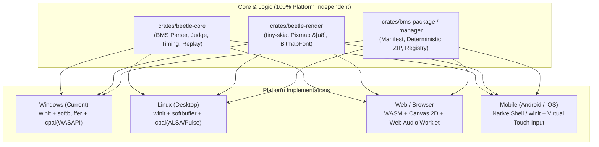

# 플랫폼 다원화 및 크로스 플랫폼 확장 제안서 (Platform Expansion Proposal)

본 문서는 Beetle 리듬 게임 엔진의 구동 플랫폼을 Windows 데스크톱 외에 **Linux 데스크톱, Web(WASM/Web Audio), 모바일/태블릿(Android/iOS)** 환경으로 확장하기 위한 기술적 타당성 분석, 아키텍처 호환성 및 해결 과제를 정리한 향후 로드맵 제안서입니다.

---

## 1. 배경 및 비전 (Background & Vision)

Beetle은 초기 설계부터 **단일 정적 바이너리(< 1 MB), 무설치(All Batteries Included), 소프트웨어 2D 렌더링(`tiny-skia` + `softbuffer`), 락프리 오디오 파이프라인**을 지향하여 작성되었습니다. 

이러한 GPU 드라이버 무의존성과 순수 Rust 구현체는 다음과 같은 확장 가능성을 제공합니다:
1. **Linux 데스크톱 (Steam Deck / Linux PC)**: 네이티브 패키징 및 저사양 머신 구동.
2. **Web / WebAssembly (Browser)**: 프로그램 설치 없이 브라우저에서 `.bmsp` 패키지 드래그 앤 드롭으로 BMS 차보 감상 및 플레이.
3. **Mobile / Tablet (Android / iOS)**: 리플레이/차보 뷰어 및 태블릿 기반 대화면 터치 리듬 게임.

---

## 2. 아키텍처 다이어그램 및 모듈 호환성

### 크레이트별 이식성 매트릭스

| 크레이트 | Windows (현재) | Linux | Web (WASM) | Mobile (Android/iOS) | 비고 |
| :--- | :---: | :---: | :---: | :---: | :--- |
| `beetle-core` | ✅ 100% | ✅ 100% | ✅ 100% | ✅ 100% | OS API 전혀 없음 (`no_std` 전환 가능) |
| `beetle-render` | ✅ 100% | ✅ 100% | ✅ 100% | ✅ 100% | `tiny-skia`는 순수 Rust CPU 래스터라이저로 메모리 버퍼(`&[u8]`) 출력 |
| `bms-package` | ✅ 100% | ✅ 100% | ✅ 100% | ✅ 100% | 결정론적 Zip 파서 및 매니페스트 |
| `beetle-audio` | ✅ cpal (WASAPI) | ✅ cpal (ALSA) | ⚠️ Web Audio 필요 | ⚠️ AAudio / CoreAudio | 플랫폼별 오디오 백엔드 차이 존재 |
| `beetle-app` | ✅ winit+softbuffer | ✅ X11/Wayland | ⚠️ Canvas/Event Loop | ⚠️ Touch/Virtual Keypad | 입력 장치 및 I/O 모델 차이 |

---

## 3. 핵심 기술적 난관 및 해결 방안 (Technical Challenges & Solutions)

### 🚨 1) Web Audio & 브라우저 자동 재생 정책
- **난관**:
  - 브라우저는 사용자 제스처(클릭/터치) 이전에 오디오 생성을 차단(`Autoplay Policy`).
  - 브라우저 WASM 단일 스레드 환경에서는 Rust `thread::spawn` 및 `rtrb` 락프리 SPSC 버퍼를 일반적인 방식으로 구동하기 어려움 (`SharedArrayBuffer`는 특수 보안 헤더 요구).
- **해결 방안**:
  - 메인 화면 진입 전 "Click to Start" 오디오 언락 게이트웨이 제공.
  - Web Audio의 `AudioWorkletNode`로 Beetle의 PCM 사운드뱅크 믹서 알고리즘을 이식하거나 `wasm-bindgen-futures` 기반 오디오 워커 구성.

### 🚨 2) 파일 시스템 부재와 VFS (Virtual File System / IndexedDB)
- **난관**:
  - 웹/모바일 샌드박스는 `std::fs`로 `songs/` 디렉터리의 수백 개 WAV/OGG 파일에 직접 접근할 수 없음.
- **해결 방안**:
  - **웹 드래그 앤 드롭 (`.bmsp`)**: 사용자가 브라우저 창에 `.bmsp` 단일 패키지 아카이브를 드롭하면 메모리 상에서 직접 읽어 압축 해제.
  - **IndexedDB 영속화**: 다운로드한 BMS 곡, 하이스코어, 리플레이를 브라우저 내장 `IndexedDB`에 영속화.

### 🚨 3) 모바일 터치 입력 지연 및 7K+1S 조작계
- **난관**:
  - 모바일 터치스크린은 하드웨어상 20~40ms의 입력 지연이 발생하며, 8개 레인(건반 7개 + 스크래치 1개)을 좁은 화면에서 손가락으로 타건하기 어려움.
- **해결 방안**:
  - **뷰어 모드 (Viewer / AutoPlay / Replay)**: 모바일에서는 리플레이 감상, 차보 미리보기, 곡 검색 및 스코어 열람 기능 우선 지원.
  - **태블릿 터치 모드**: 10인치 이상 대화면 태블릿 기기를 위한 오락실 비트콘 형태의 가상 터치 인터페이스(Virtual Keypad / Scratch Flick) 제공.

### 🚨 4) 고해상도(Retina / 4K) 소프트웨어 렌더링 Blit 최적화
- **난관**:
  - 모바일 고해상도(예: 3000x2000) 화면에 1:1로 CPU 소프트웨어 렌더링을 수행하면 Blit 부하가 증가할 수 있음.
- **해결 방안**:
  - 내부 프레임버퍼 렌더링 해상도는 `1024x768` 또는 `1280x720`으로 고정하고, 화면에는 HTML5 Canvas CSS 또는 OS 하드웨어 스케일러로 확대 출력.

---

## 4. 단계별 구현 로드맵 (Phased Implementation Plan)

### Phase 1: Linux 데스크톱 빌드 및 CI 파이프라인
- [ ] Linux 타겟(`x86_64-unknown-linux-gnu`) 빌드 및 `cpal` ALSA/PulseAudio 백엔드 검증.
- [ ] GitHub Actions Linux 빌드 아티팩트 자동 생성 추가.

### Phase 2: WebAssembly (WASM) 웹 플레이어 / 뷰어 (`beetle-web`)
- [ ] `wasm32-unknown-unknown` 타겟 크레이트 생성 (`crates/beetle-web`).
- [ ] HTML5 `<canvas>` 및 Web Audio API 바인딩.
- [ ] `.bmsp` 아카이브 드래그 앤 드롭 로더 및 웹 UI 쉘 구현.

### Phase 3: 모바일 터치 가상 키패드 및 반응형 뷰어 UI
- [ ] `winit` 터치 이벤트(`TouchPhase`)를 `Lane` 판정 이벤트로 변환하는 모바일 입력 어댑터 구현.
- [ ] 모바일/태블릿 화면 크기 대응 반응형 레이아웃 및 뷰어 컨트롤러 추가.
