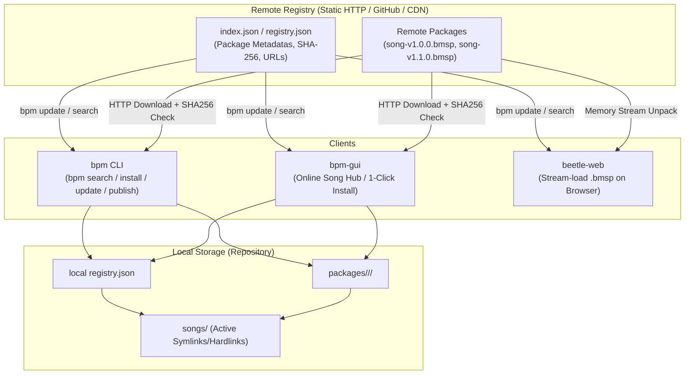

# 원격 패키지 레지스트리 및 네트워크 배포 제안서 (Remote Package Registry & Network Distribution)

본 문서는 `bms-package`, `bms-package-manager`, `bpm` CLI 및 `bpm-gui`를 확장하여 **네트워크를 통해 BMS 패키지(`.bmsp`)를 원격 저장소에서 검색, 1-클릭 다운로드/설치, 업데이트 및 배포(Publish)**할 수 있도록 설계한 네트워크 패키지 매니저 확장 제안서입니다.

---

## 1. 비전 및 핵심 목표 (Vision & Core Goals)

기존 BMS 생태계는 대용량 압축 파일(`.zip`, `.rar`, `.7z`)을 웹사이트나 드라이브에서 수동 다운로드 후 폴더 압축 해제, 파일 경로 오류, 인코딩 깨짐, 버전 파편화 문제가 심각했습니다.

Beetle의 원격 패키지 배포 시스템은 다음과 같은 **"Cargo / NPM 스타일의 BMS 배포 혁신"**을 목표로 합니다:
1. **1-명령어 설치 (`bpm install <song-id>`)**: 원격 레지스트리에서 메타데이터와 SHA-256 검증을 거쳐 자동 다운로드 및 무결성 설치.
2. **GUI 원클릭 다운로드 (`bpm-gui` Song Hub)**: 곡 목록 탐색, 스테이지 이미지/BGA 미리보기, 원클릭 설치.
3. **정적 호스팅 친화적 레지스트리 (Static CDN/GitHub Pages)**: 무거운 백엔드 서버 없이 단일 `index.json`과 `.bmsp` 정적 파일만으로 누구든 개인/커뮤니티 레지스트리 운영 가능.
4. **LAN / P2P 로컬 공유 (`bpm serve`)**: 같은 Wi-Fi/로컬 네트워크에 있는 기기(PC, 태블릿, 모바일)끼리 즉시 곡을 공유하고 동기화.

---

## 2. 네트워크 배포 아키텍처 다이어그램



---

## 3. 원격 레지스트리 인덱스 포맷 (`index.json`)

별도의 복잡한 데이터베이스 서버 없이 정적 웹 서버(GitHub Pages, Cloudflare R2, AWS S3 등)에 호스팅할 수 있는 표준 규격입니다.

```json
{
  "format_version": "1.0.0",
  "name": "Beetle Official Song Registry",
  "url": "https://packages.beetle-engine.org",
  "updated_at": "2026-08-28T12:00:00Z",
  "packages": [
    {
      "id": "conflict",
      "version": "1.0.0",
      "title": "Conflict",
      "artist": "siqlo + cranky",
      "genre": "HARMONIC HARDCORE",
      "bpm": 160.0,
      "play_levels": [5, 9, 11],
      "keysounds_count": 480,
      "size_bytes": 14500000,
      "sha256": "e3b0c44298fc1c149afbf4c8996fb92427ae41e4649b934ca495991b7852b855",
      "download_url": "https://packages.beetle-engine.org/conflict-1.0.0.bmsp",
      "preview_audio_url": "https://packages.beetle-engine.org/conflict-preview.ogg",
      "banner_image_url": "https://packages.beetle-engine.org/conflict-banner.bmp"
    }
  ]
}
```

---

## 4. `bpm` CLI 확장 명령어 세부 설계

```bash
# 1. 원격 레지스트리 목록 갱신 (인덱스 캐시 동기화)
bpm update

# 2. 온라인 패키지 검색 (제목, 아티스트, 장르, 난이도)
bpm search conflict
bpm search --level 10..12 --genre trance

# 3. 원격 패키지 1-클릭 다운로드 & 설치 & 활성화
bpm install conflict
bpm install conflict@1.2.0

# 4. 설치된 패키지 중 새 버전이 있는 곡 일괄 업그레이드
bpm upgrade

# 5. 로컬 LAN 간이 배포 서버 구동 (근처 기기 / 모바일 공유용)
bpm serve --port 8080

# 6. 새 원격 소스(커뮤니티 레지스트리) 추가 및 관리
bpm source add community https://bms-hub.example.com/index.json
bpm source list
```

---

## 5. 의존성 및 바이너리 크기 전략 (< 1 MB 불변식 유지)

네트워크 통신 추가 시 가장 주의해야 할 점은 **Tokio 비동기 런타임이나 거대한 HTTP 클라이언트(`reqwest`)를 끌어들여 바이너리가 수 MB 단위로 부풀어 오르는 것을 차단**하는 것입니다.

### 🚫 지양할 방식
- `reqwest` + `tokio` (바이너리 +4~6 MB 증가, 비동기 스케줄러 오버헤드)

### ✅ 채택할 경량 방식
1. **`ureq` (권장)**:
   - 순수 동기식(Blocking) 경량 HTTP 라이브러리 (바이너리 증가량 < 150 KB).
   - 백그라운드 Worker 스레드(`thread::spawn`)에서 스트리밍 다운로드 및 프로그레스 바 구현.
   - TLS/HTTPS 지원 (Rustls 최소 피처 활성화).
2. **SHA-256 무결성 검증**:
   - `sha2` 경량 크레이트(또는 Beetle 내장 암호화 해시)를 통해 다운로드 바이트 검증.

---

## 6. `bpm-gui` 및 `beetle-web`과의 연계 시너지

1. **`bpm-gui` Online Hub**:
   - GUI 좌측 탭에 `Online Store / Song Hub` 탭 추가.
   - 앨범 아트 그리드 뷰, 난이도 필터, 프리뷰 오디오 즉시 재생, "Install / Update" 버튼 제공.
2. **`beetle-web` 무설치 스트리밍**:
   - 웹 브라우저에서 인덱스를 읽고, 사용자가 곡을 선택하면 백그라운드에서 `.bmsp`를 fetch하여 즉시 메모리에 언팩 후 플레이.

---

## 7. 단계별 구현 계획 (Phased Implementation Plan)

### Phase 1: `bms-package-manager` 원격 인덱스 및 다운로더 구현
- [ ] `RemoteRegistryIndex`, `RemotePackageMetadata` 구조체 및 직렬화 구현.
- [ ] `ureq` 기반 경량 HTTP 다운로드 & 프로그레스 콜백 및 SHA-256 검증 로직 구현.
- [ ] 원격 `.bmsp` 다운로드 ➔ 원자적 설치 파이프라인 연동.

### Phase 2: `bpm` CLI 네트워크 서브커맨드 구현
- [ ] `bpm update`, `bpm search`, `bpm install <id>`, `bpm upgrade` 구현.
- [ ] `bpm source` (원격 저장소 URL 관리) 구현.

### Phase 3: `bpm-gui` Online Song Hub 탭 UI 구현
- [ ] 원격 패키지 검색/필터링 캐러셀 및 다운로드 프로그레스 바 UI.
- [ ] 1-클릭 설치 및 업데이트 알림 뱃지.

### Phase 4: `bpm serve` 로컬 LAN P2P 공유 기능
- [ ] 로컬 `packages/`를 즉시 호스팅하는 경량 HTTP 서버.
