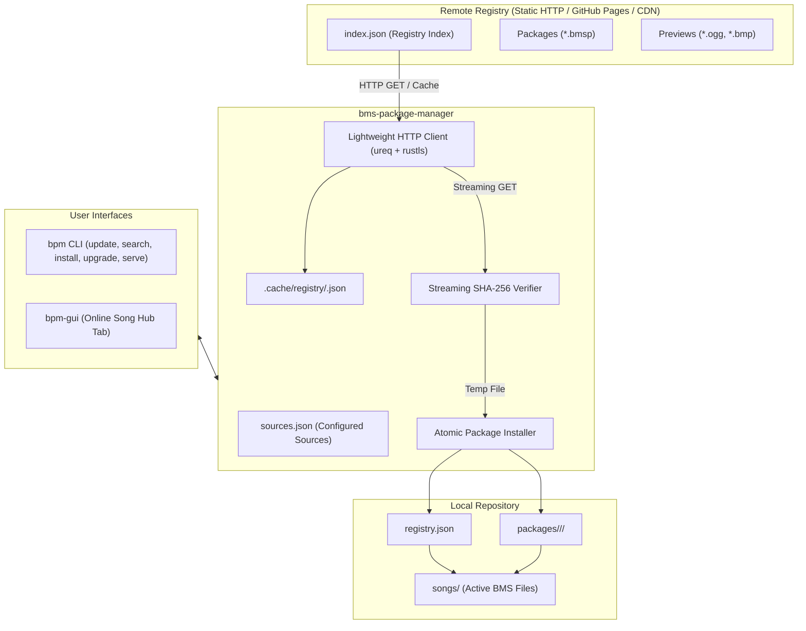

# 원격 패키지 레지스트리 및 온라인 배포 규격서 (Remote Package Registry Specification)

본 문서는 `bms-package-manager`, `bpm` CLI 및 `bpm-gui`에 원격 패키지 레지스트리 탐색, 다운로드, 무결성 검증, 자동 업데이트 및 로컬 LAN P2P 공유 기능을 제공하기 위한 공식 기술 규격서입니다.

---

## 1. 아키텍처 개요 (Architecture Overview)

Beetle의 원격 패키지 배포 시스템은 **"정적 호스팅 친화적(Static CDN / GitHub Pages) 탈중앙화 배포"**를 지향합니다.
무거운 데이터베이스 백엔드 서버 없이 단일 정적 JSON 인덱스(`index.json`)와 `.bmsp` 바이너리 파일만으로 누구나 공식/커뮤니티/개인 레지스트리를 즉시 개설할 수 있습니다.



---

## 2. 원격 레지스트리 인덱스 규격 (`index.json`)

원격 서버에 호스팅되는 표준 인덱스 파일 규격입니다.

### 2.1 스키마 정의

```json
{
  "$schema": "https://beetle-engine.org/schemas/registry-index-v1.json",
  "format_version": "1.0.0",
  "name": "Beetle Official Song Registry",
  "description": "Official community-curated BMS package repository",
  "url": "https://packages.beetle-engine.org",
  "updated_at": "2026-09-14T00:00:00Z",
  "packages": [
    {
      "id": "conflict",
      "version": "1.0.0",
      "state_hash": "a3f8c2d1e4b5...",
      "title": "Conflict",
      "artist": "siqlo + cranky",
      "genre": "HARMONIC HARDCORE",
      "bpm": 160.0,
      "play_levels": [5, 9, 11],
      "keysounds_count": 480,
      "size_bytes": 14500000,
      "sha256": "e3b0c44298fc1c149afbf4c8996fb92427ae41e4649b934ca495991b7852b855",
      "download_url": "https://packages.beetle-engine.org/conflict-1.0.0.bmsp",
      "preview_audio_url": "https://packages.beetle-engine.org/conflict-preview.ogg",
      "banner_image_url": "https://packages.beetle-engine.org/conflict-banner.bmp",
      "companion_bga": {
        "id": "conflict-bga",
        "size_bytes": 45000000,
        "sha256": "8f4a12...",
        "download_url": "https://packages.beetle-engine.org/conflict-bga-1.0.0.bmsp"
      }
    }
  ]
}
```

### 2.2 필드 명세

| 필드명 | 타입 | 필수 여부 | 설명 |
| :--- | :--- | :--- | :--- |
| `format_version` | `string` | **필수** | 인덱스 규격 버전 (예: `"1.0.0"`) |
| `name` | `string` | **필수** | 레지스트리 명칭 |
| `description` | `string` | 선택 | 레지스트리 소개 및 설명 |
| `url` | `string` | **필수** | 레지스트리 기본 루트 URL |
| `updated_at` | `string` | **필수** | ISO 8601 UTC 생성/갱신 타임스탬프 |
| `packages` | `array` | **필수** | 호스팅 중인 패키지 메타데이터 목록 |
| `packages[].id` | `string` | **필수** | 패키지 고유 식별자 (소문자, 영숫자, 하이픈) |
| `packages[].version` | `string` | **필수** | 시맨틱 버전 (SemVer 2.0) |
| `packages[].state_hash` | `string` | **필수** | `bms-package` 계산 상태 해시 |
| `packages[].title` | `string` | **필수** | 곡 제목 |
| `packages[].artist` | `string` | **필수** | 아티스트명 |
| `packages[].genre` | `string` | 선택 | 음악 장르 |
| `packages[].bpm` | `number` | 선택 | 기본 템포 (BPM) |
| `packages[].play_levels` | `array[u32]` | 선택 | 포함된 채보 난이도 레벨 배열 |
| `packages[].keysounds_count` | `u32` | 선택 | 전체 수록 키음 개수 |
| `packages[].size_bytes` | `u64` | **필수** | `.bmsp` 아카이브 파일 크기 (바이트) |
| `packages[].sha256` | `string` | **필수** | `.bmsp` 아카이브 파일의 SHA-256 16진수 체크섬 (64자) |
| `packages[].download_url` | `string` | **필수** | 패키지 다운로드 절대/상대 URL |
| `packages[].preview_audio_url` | `string` | 선택 | 15~30초 미리듣기 오디오 OGG/WAV URL |
| `packages[].banner_image_url` | `string` | 선택 | 배너 이미지 (BMP/PNG) URL |
| `packages[].companion_bga` | `object` | 선택 | 분리형 대용량 BGA 패키지 메타데이터 |

---

## 3. 로컬 소스 설정 규격 (`sources.json`)

사용자 로컬 저장소(`packages/../sources.json`)에 저장되는 소스 설정입니다.

```json
{
  "sources": [
    {
      "id": "official",
      "name": "Beetle Official Registry",
      "url": "https://packages.beetle-engine.org/index.json",
      "enabled": true,
      "priority": 100
    },
    {
      "id": "community",
      "name": "Community Hub",
      "url": "https://bms-hub.example.com/index.json",
      "enabled": true,
      "priority": 50
    }
  ]
}
```

- **다중 소스 병합 규칙**: 동일한 패키지 `id`가 복수 소스에 존재하는 경우 `priority`가 높은 소스의 패키지가 우선 선택됩니다.

---

## 4. 네트워크 프로토콜 및 경량 HTTP 클라이언트 설계

### 4.1 의존성 정책 준수 (`AGENTS.md`)
- **Tokio & Reqwest 금지**: 비동기 런타임 탑재로 인한 바이너리 팽창(+4~6 MB)을 철저히 배제합니다.
- **`ureq` (순수 동기식 HTTP 클라이언트)**:
  - Rustls 최소 피처(`ureq` with `tls`) 활성화 (바이너리 증가량 < 150 KB).
  - 차단 없는 백그라운드 Worker 스레드(`std::thread::spawn`)에서 스트리밍 I/O 수행.
- **타임아웃 & 헤더**:
  - 연결 타임아웃: 10초, 읽기 타임아웃: 30초.
  - User-Agent: `Beetle-Package-Manager/<version> (Windows; x86_64)`.

### 4.2 프로그레스 콜백 및 스트리밍 SHA-256 검증
패키지 다운로드 중 메모리에 전체 바이너리를 버퍼링하지 않고, 64 KB 청크 단위로 디스크 임시 파일(`.tmp`)에 스트리밍 저장하면서 실시간으로 SHA-256 해시를 누적 계산합니다.

```rust
pub trait DownloadProgressCallback: Send + 'static {
    fn on_progress(&mut self, downloaded_bytes: u64, total_bytes: Option<u64>);
}
```

---

## 5. 원자적 다운로드 & 설치 트랜잭션 라이프사이클

다운로드와 설치 도중 네트워크 단절, 프로세스 강제 종료, 체크섬 불일치가 발생해도 로컬 라이브러리가 오염되지 않도록 보장합니다.

```text
1. [Prepare]    패키지 메타데이터 확인 및 로컬 디스크 공간 사전 검사
                     ↓
2. [Download]   .cache/downloads/<id>-<state>.tmp 파일로 스트리밍 다운로드
                     ↓
3. [Verify]     다운로드된 파일의 SHA-256 체크섬을 index.json과 대조 검증
                (불일치 시 즉시 .tmp 삭제 및 에러 반환)
                     ↓
4. [Unpack]     임시 디렉터리(.cache/staging/<id>/<state>/)에 패키지 검증
                     ↓
5. [Atomic Move] target managed 디렉터리(packages/<id>/<state>/)로 원자적 이동
                     ↓
6. [Registry]   registry.json 원자적 갱신 및 active_state 지정
                     ↓
7. [Active Link] songs/ 디렉터리에 심볼릭/하드링크 생성 또는 파일 배치
```

---

## 6. `bpm` CLI 확장 명령어 명세

| 명령어 | 설명 | 예시 |
| :--- | :--- | :--- |
| `bpm update` | 등록된 모든 원격 레지스트리 `index.json`을 갱신하고 로컬 캐시를 동기화 | `bpm update` |
| `bpm search <query>` | 캐시된 원격 및 로컬 패키지 인덱스에서 제목/아티스트/장르 검색 | `bpm search conflict` |
| `bpm install <id>` | 원격 레지스트리에서 패키지를 다운로드하여 무결성 검증 후 자동 설치 | `bpm install conflict` |
| `bpm upgrade` | 설치된 패키지 중 원격에 상위 버전이 있는 곡을 일괄 다운로드/업그레이드 | `bpm upgrade` |
| `bpm source list` | 등록된 원격 소스 목록 및 상태 조회 | `bpm source list` |
| `bpm source add <id> <url>` | 새로운 원격 소스(커뮤니티 레지스트리) 추가 | `bpm source add my-hub https://example.com/index.json` |
| `bpm source remove <id>` | 원격 소스 삭제 | `bpm source remove my-hub` |
| `bpm serve [--port <p>]` | 로컬 `packages/` 저장소를 LAN 공유용 정적 HTTP 레지스트리로 즉시 호스팅 | `bpm serve --port 8080` |

---

## 7. `bpm-gui` 온라인 송 허브 (Online Song Hub) UI 명세

### 7.1 화면 레이아웃 및 탭 분리
- **탭 네비게이션**: 상단 헤더에 `[Installed Library]`와 `[Online Song Hub]` 탭 전환 버튼 제공.
- **검색 및 필터 바**:
  - 검색창 (실시간 텍스트 필터링: 제목, 아티스트, 장르).
  - 난이도 필터 (`All`, `1~4`, `5~8`, `9~11`, `12+`).
  - 정렬 기준 (`Newest`, `Title`, `Size`, `Popularity`).
- **곡 카드 그리드 / 리스트 뷰**:
  - 배너 이미지 또는 앨범 아트 썸네일.
  - 곡 정보 (제목, 아티스트, 장르, BPM, 채보 레벨 뱃지, 패키지 용량).
  - 상태 버튼:
    - 미설치: `[Install]` (원클릭 다운로드 & 설치).
    - 설치됨 (최신): `[Installed] (Checkmark)`.
    - 설치됨 (업데이트 가능): `[Update Available]` (원클릭 업그레이드).
    - 다운로드 진행 중: 프로그레스 바 및 `[XX.X MB / YY.Y MB (ZZ%)]` 표시.

### 7.2 논블로킹 UI 이벤트 연동 (`INV-5`)
- 다운로드 및 인덱스 갱신은 백그라운드 Worker 스레드(`std::thread`)에서 비동기로 실행되며, MPSC 채널(`Receiver<DownloadEvent>`)을 통해 진행 상황을 메인 UI 루프로 전달합니다.
- 다운로드 중에도 GUI 창 이동, 크기 조절, 타 화면 탐색이 60 FPS 무중단으로 유지됩니다.

---

## 8. 로컬 LAN 간이 배포 서버 규격 (`bpm serve`)

- **목적**: 동일 Wi-Fi / 로컬 네트워크 상의 다른 PC, 태블릿, 모바일 기기 간에 인터넷 연결 없이도 곡을 즉시 공유.
- **구현 방식**:
  - 순수 표준 라이브러리 `std::net::TcpListener` 기반 미니 정적 HTTP/1.1 파일 서버 구현 (외부 대형 웹서버 크레이트 0개).
  - 요청 경로 매핑:
    - `GET /` 또는 `GET /index.json`: 로컬 `registry.json`을 기반으로 실시간 합성한 `index.json` 반환.
    - `GET /packages/<filename>.bmsp`: 로컬 패키지 바이너리 스트리밍 반환.
- **호출 예시**:
  ```bash
  bpm serve --port 8080
  # [BPM] Local LAN Registry listening on http://192.168.1.15:8080/index.json
  # [BPM] Other devices can add this source: bpm source add lan http://192.168.1.15:8080/index.json
  ```

---

## 9. 보안 및 예외 처리 규격 (Security & Reliability)

1. **경로 탈출(Path Traversal) 방지**: 다운로드 파일명 및 패키지 `id`에 `..`, `/`, `\` 등의 경로 조작 문자가 포함된 경우 즉각 거부합니다.
2. **SHA-256 무결성 강제 검증**: 원격 `index.json`에 기재된 `sha256` 해시와 다운로드된 파일의 실측 해시가 1바이트라도 다르면 파일은 즉시 폐기되며 설치가 중단됩니다.
3. **용량 상한선(Safety Cap)**: `Content-Length` 또는 다운로드 누적 크기가 비정상적으로 큰 파일(예: 단일 패키지 > 2 GB)의 경우 사전 경고 또는 거부 처리합니다.
4. **네트워크 장애 회복력**: 다운로드 도중 연결이 끊기면 임시 파일(`.tmp`)을 정리하고 트랜잭션을 롤백하여 기존 설치본을 온전히 보존합니다.
